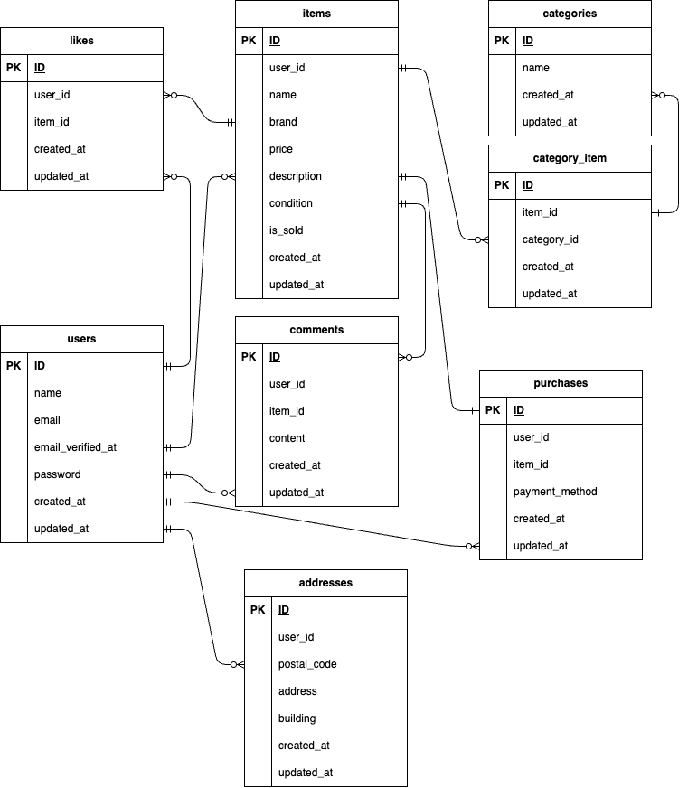

## アプリケーション名

フリマアプリ

## 環境構築

1,Docker コンテナを起動

```
docker-compose up -d --build
```

2,php コンテナ内で Laravel の初期設定を行う
.env の作成 アプリケーションキーを生成

```
docker-compose exec php bash
composer install
cp .env.example .env
php artisan key:generate
```

3,データベースの接続設定を行う
.env の修正

```
DB_CONNECTION=mysql
DB_HOST=mysql
DB_PORT=3306
DB_DATABASE=laravel_db
DB_USERNAME=laravel_user
DB_PASSWORD=laravel_pass
```

4,マイグレーションを実行

```
php artisan migrate
```

5,シーディングを実行

```
php artisan db:seed
```

## 使用技術

PHP：8.1.34
Laravel：8.83.8
mysql：8.0.26
nginx：1.21.1

## ER 図



## URL

お問い合わせ入力画面：http://localhost/
お問い合わせ管理画面：http://localhost/admin
ユーザー登録画面：http://localhost/register
